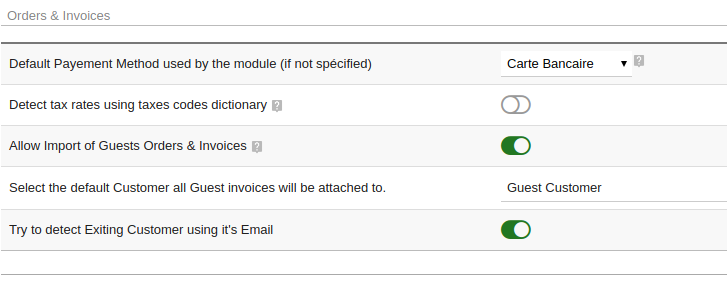
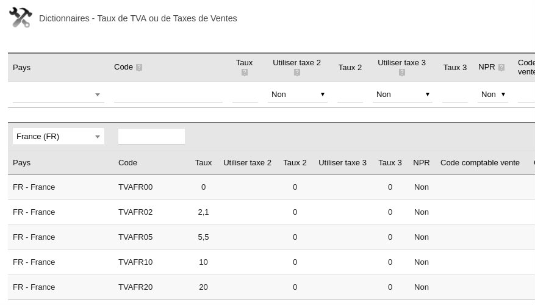
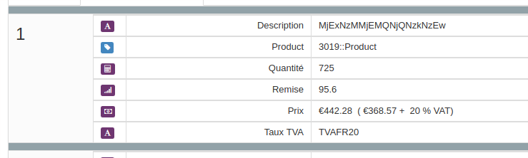

### Configure import features

Since v1.4 of Splash Module for Dolibarr, a dedicated configuration block groups all orders and
invoices import parameters.

### Tax rates detection

When importing orders and invoices lines, the Splash module is able to identify the line's tax rate
using a shared tax code.

This feature is useful for countries that have multiple or complex VAT rates (i.e. Canada).

#### How to configure it?

First, you need to define, on each server, the same codes for VAT rates. For Dolibarr, this setup
is available in **Setup > Dictionary setup > VAT Rates or Sales Tax Rates**.

With Dolibarr, the VAT rate name is "Code", this value is empty by default. Generally, you can use
the codes used by your e-commerce.

#### How does it work?

If you have a look at the data available for Orders & Invoices objects, you will see a field called
"VAT Rate".

When Splash imports an order or an invoice, if the given code is found in your Dolibarr dictionary,
Splash uses this VAT rate to create the product line.

#### Limitations

Up to now, only part of our modules are compatible with this feature.

> [!IMPORTANT]
> To use this feature, you must ensure VAT rates codes are **strictly** identical on all connected
> applications.

### Import of guest orders

#### Why?

Most modern e-commerce platforms now offer customers the possibility to place an order without
creating any customer account. On the ERP side, it is not possible to create an order (or invoice)
without pointing to a customer. To solve this problem, we developed a specific feature.

#### What does it do?

When you enable **Import of Guests Orders & Invoices**, Splash removes the **required** flag on the
customer link. This way, the Splash server will push all new orders and invoices to Dolibarr,
whether they have a customer defined or not.

In this mode, any order (or invoice) that has no customer defined will be attached to a predefined
default customer.

#### Configuration

To use this mode, just enable the feature and select the default customer to use.

> [!TIP]
> We highly recommend the creation of a dedicated customer.

#### Email detection

This additional feature may be used to detect already known customers using their email, if
provided by the server. If the given email belongs to an existing third party, the order will be
attached to this customer and not to the default customer.
