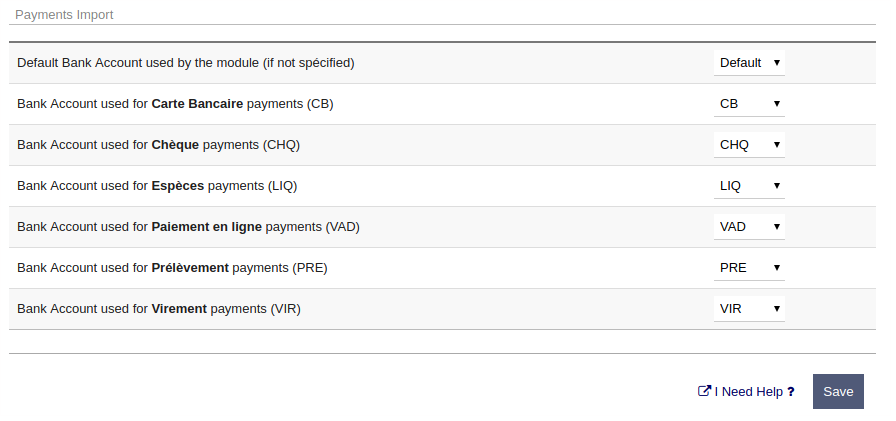

### Ventilation bancaire

Depuis la version 1.4 du module Splash pour Dolibarr, il est possible de sélectionner, pour chaque
mode de paiement actif, le compte bancaire que vous souhaitez utiliser.

#### Méthode de paiement par défaut

Lorsqu'un paiement de facture est importé, si aucune méthode de paiement valide n'est indiquée,
Splash utilisera cette méthode de paiement par défaut pour créer le paiement.

#### Compte bancaire par défaut

Lorsqu'un paiement de facture est importé, si aucun compte bancaire spécifique n'est indiqué, Splash
utilisera cette valeur par défaut.

#### Compte bancaire par méthode

Pour chaque méthode de paiement **active**, sélectionnez le compte bancaire cible à utiliser.
