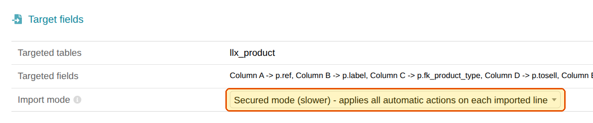

L'assistant d'import de Dolibarr permet de créer ou de mettre à jour des tiers, contacts, produits,
commandes ou factures en masse, à partir d'un fichier CSV ou Excel.

Depuis **Dolibarr 24**, ces imports sont synchronisés **nativement** par Splash : chaque ligne
importée est transmise à vos autres applications, exactement comme une saisie manuelle. Une seule
condition : choisir le bon mode d'importation. :white_check_mark:

### Choisissez le mode sécurisé

Dans **Outils > Imports > Nouvel import**, à l'étape des champs cibles, sélectionnez dans
**Mode d'importation** :

**Mode sécurisé (plus lent) - applique toutes les actions automatiques à chaque ligne importée**

C'est le mode proposé par défaut : il suffit de ne pas le modifier.

> [!WARNING]
> En **mode rapide**, Dolibarr n'exécute aucune action automatique sur les lignes importées :
> Splash n'est pas informé des changements, et les données importées ne sont pas synchronisées.

> [!NOTE]
> La simulation d'import n'exécute jamais d'actions automatiques : c'est normal, rien n'est
> encore écrit en base. La synchronisation a lieu lors de l'import définitif.

### Et si vous importez en masse ?

Le mode sécurisé est plus lent, car chaque ligne déclenche les mêmes traitements qu'une saisie
manuelle. Pour de très gros fichiers, découpez-les en plusieurs imports plutôt que de passer en
mode rapide.

> [!TIP]
> Le mode proposé par défaut peut être modifié par votre administrateur Dolibarr. Si
> l'assistant vous propose le mode rapide, repassez simplement en mode sécurisé avant de lancer
> l'import.

### Versions antérieures à Dolibarr 24

Avant la version 24, l'assistant d'import de Dolibarr écrit directement en base, sans déclencher
aucune action automatique : Splash ne voit pas les données importées.

Ces enregistrements ne seront synchronisés qu'à leur prochaine modification dans Dolibarr. Si vos
imports sont fréquents, une mise à jour vers Dolibarr 24 est le moyen le plus simple d'en
bénéficier.
