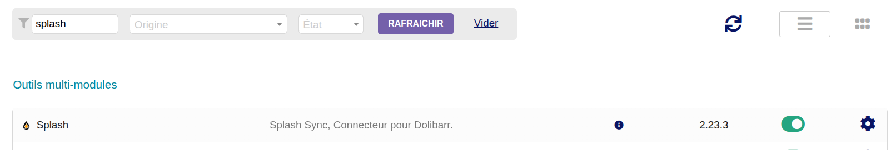

### Requisiti

- Dolibarr **14** o successivo
- PHP **7.4** o successivo
- Un account Splash Sync attivo

### Scaricate il modulo

Scaricate l'ultima versione del modulo direttamente da questa pagina: è il file
`module_splash-x.y.z.zip`.

Vi serve una versione precedente? Tutte le versioni pubblicate sono disponibili sulla
[pagina delle versioni GitHub](https://github.com/SplashSync/Dolibarr/releases).

> [!NOTE]
> Per l'installazione dall'interfaccia, non decomprimete l'archivio: Dolibarr si aspetta il file
> `.zip` così com'è.

### Installate dall'interfaccia di Dolibarr

È il metodo più semplice, senza bisogno di accedere al server.

1. Andate su **Impostazioni > Moduli/Applicazioni**.
2. Aprite la scheda **Trova app/moduli esterni...**.
3. Selezionate il file `module_splash-x.y.z.zip` e inviatelo.

Dolibarr decomprime l'archivio e installa il modulo nella sua cartella `custom`.

> [!WARNING]
> L'installazione dall'interfaccia può essere bloccata:
> - **file troppo grande**: l'archivio pesa quasi 2 MB, cioè il limite predefinito di PHP. La
>   dimensione massima dipende dal vostro hosting (parametri PHP `upload_max_filesize` e
>   `post_max_size`) e da Dolibarr (**Impostazioni > Sicurezza**, scheda **File**); il limite in
>   vigore è indicato accanto al campo di invio;
> - **installazione di moduli esterni disattivata**: il file `installmodules.lock` è presente nella
>   cartella dei dati di Dolibarr; chiedete al vostro amministratore di eliminarlo;
> - **cartella radice alternativa non definita**: la cartella `custom` non è dichiarata nel file
>   `conf.php` di Dolibarr.
>
> In tutti i casi, potete anche ricorrere all'installazione manuale.

### Oppure installate manualmente

1. Decomprimete l'archivio.
2. Copiate la cartella `splash` nella cartella `htdocs/custom` di Dolibarr, per ottenere
   `htdocs/custom/splash`.

### Attivate il modulo

In **Impostazioni > Moduli/Applicazioni**, il modulo Splash si trova nella famiglia **Interfacce
con sistemi esterni**: attivatelo.

Il modulo è pronto: non resta che configurarlo.
