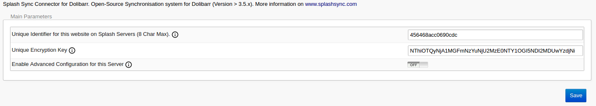
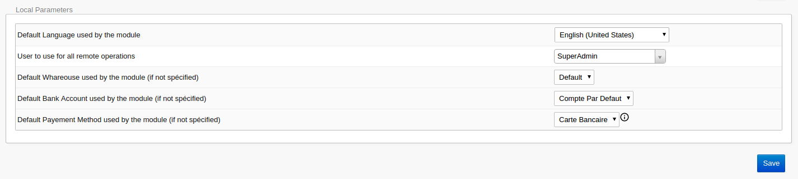
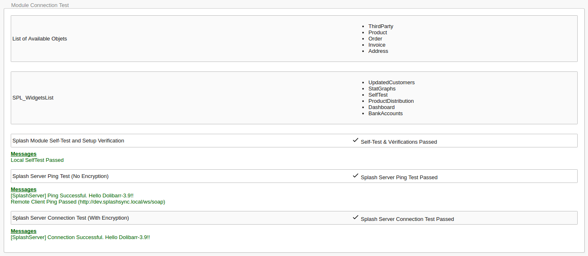

Nach der Aktivierung muss das Modul mit Ihrem Splash-Konto verbunden werden und einige
Standardwerte erhalten. Rechnen Sie mit wenigen Minuten :stopwatch:

Um die Konfiguration zu öffnen, klicken Sie unter **Einstellungen > Module/Anwendungen** auf das
Einstellungssymbol des Splash-Moduls.

### Mit Ihrem Splash-Konto verbinden

Erstellen Sie zunächst die Zugangsschlüssel Ihres Servers: Gehen Sie in Ihrem Splash-Bereich zu
**Server** > **Server hinzufügen** und notieren Sie die Server-Kennung und den
Verschlüsselungsschlüssel.

Geben Sie diese beiden Schlüssel anschließend im Block **Main Parameters** der
Modulkonfiguration ein.

> [!IMPORTANT]
> Kopieren Sie die Schlüssel unverändert, ohne überflüssige Leerzeichen oder fehlende Zeichen: Ein
> einziges falsches Zeichen verhindert jede Verbindung.

### Standardparameter festlegen

Der Block **Local Parameters** enthält die Werte, die immer dann verwendet werden, wenn ein Objekt
ohne expliziten Wert angelegt oder geändert wird.

> [!NOTE]
> Das Modul ist noch nicht ins Deutsche übersetzt: Dolibarr zeigt seine Konfigurationsseite auf
> Englisch an.

#### Standardsprache

Die Sprache, in der das Modul mit dem Splash-Server kommuniziert.

#### Standardbenutzer

Der Benutzer, in dessen Namen das Modul alle seine Aktionen ausführt.

> [!TIP]
> Legen Sie einen eigenen Benutzer für Splash an: Das Modul wendet die Rechteverwaltung von
> Dolibarr an, daher muss dieser Benutzer Rechte auf alle Objekte haben, die Sie synchronisieren
> möchten.

#### Standardlager, -bankkonto und -zahlungsart

Die Werte, die verwendet werden, wenn die andere Anwendung keine liefert.

### Ergebnisse der Selbsttests prüfen

Bei jedem Speichern der Konfiguration prüft das Modul Ihre Parameter und stellt sicher, dass die
Kommunikation mit Splash funktioniert.

> [!WARNING]
> Alle Tests müssen grün sein: Ein fehlgeschlagener Selbsttest bedeutet, dass der Server nicht
> synchronisieren kann.

